# Introduction
Suppose you own an e-commerce website selling bike accessories.  
You have millions of visitors a month, you want to analyze the website traffic, consumer patterns and predict sales.  
This workshop will walk you through the process of building an end-to-end Real time Analytics Solution in MS Fabric, using the medallion architecture, for your e-commerce website.  


You will learn how to:
* Build a medallion architecture in MS Fabric Real time analytics
* Use Fabric data pipelines for copying data from an operational DB (SQL server with Adventure works sample data)
* Stream events and ingest them into MS Fabric RTA (Real time analytics) using EventStream
* Create data transformations in Fabric RTA (Real time analytics)
* Create reports for real time visualizations using RTA (Real time analytics) dashboards

All the code in this tutorial can be found here:   
[Building a Medallion Architecture on Fabric Real time analytics](<https://github.com/microsoft/FabricRTA-Retail/>)  

Authors:
[Denise Schlesinger](<https://github.com/denisa-ms>), Microsoft, Prin CSA
Hiram Fleitas](<https://aka.ms/hiram>), Microsoft, Sr CSA
Guy Yehudy, Microsoft, Prin PM


---

# What is the Medallion Architecture?
The inspiration for this tutorial was the realization that Eventhouse aligns perfectly with the Medallion’s architecture requirements.
The Medallion architecture is a data design pattern with 3 layers:

* The Bronze layer: containing raw data being streamed into a data platform, these are Eventhouse continuous ingestion capabilities.  

* The Silver Layer: a curated enriched layer of data, based on transformed data from the Bronze layer. This can be achieved with Eventhouse’s update policies.   

* The Gold Layer: aggregated data for reporting and BI, this can be achieved with Eventhouse’s materialized views.  
So, in this article we will explore how to build a Real time analytics platform using the Medallion architecture using MS Fabric Eventhouse.  

A detailed blog post explaining this tutorial can be found here:  
[Building a Medallion Architecture on Fabric Real time analytics](<https://techcommunity.microsoft.com/t5/startups-at-microsoft/building-a-real-time-medallion-architecture-using-eventhouse-in/ba-p/4110686>)  

A medallion architecture (also coined by Databricks) is a data design pattern used to logically organize data.
The goal is to incrementally improve the structure and quality of data as it flows through each layer of the architecture.
Medallion architectures are sometimes also referred to as "multi-hop" architectures.

Creating a multi layer data platform allow companies to improve data quality across the layers and at the same time provide for their business needs.
Unstructured and raw data are ingested using scalable pipelines to output the highest quality enriched data.

---

# Fabric Real time analytics features 

## Event streams
* [Event streams](<https://learn.microsoft.com/en-us/fabric/real-time-analytics/event-streams/overview>)   
  Clicks and Impressions events are ingested from an Eventstream into the "Event" table

## Data pipelines
* [Data pipelines](<https://learn.microsoft.com/en-us/fabric/data-factory/tutorial-end-to-end-pipeline>)  
  Bronze layer tables are populated by an MS Fabric Data pipeline copying data from our operational SQL DB 

## Shortcuts
* [Shortcuts](<https://learn.microsoft.com/en-us/fabric/real-time-analytics/onelake-shortcuts?tabs=onelake-shortcut>) 
  Product and ProductCategory tables are defined as external tables (fabric shortcuts) hosted in our operational SQL DB.  
  Meaning the data is not copied but served from the SQL DB itself.  

  Shortcuts enable us to create live connections between OneLake and existing target data sources, whether internal or external to Azure. This allows us to retrieve data from these locations as if they were seamlessly integrated into Microsoft Fabric.  
  A shortcut is a schema entity that references data stored external to a KQL database in your cluster.  
  In Lakehouses and Kusto Query Language (KQL) databases, it's possible to create shortcuts referencing Internal locations within Microsoft Fabric, ADLS Gen2, Spark Notebooks, AWS S3 storage accounts, or Microsoft Dataverse. From my perspective, I value the fact that all data is aligned under a unified namespace, allowing seamless access through the same ADLS Gen2 APIs, even when sourced from AWS S3.
  By enabling us to reference different storage locations, OneLake's Shortcuts provides a unified source of truth for all our data within the Microsoft Fabric environment and ensures clarity regarding the origin of our data.  

## KQL DB - Update policies  
* [KQL DB - Update policies](<https://learn.microsoft.com/en-us/azure/data-explorer/kusto/management/update-policy>)    
  Update policies are automation mechanisms triggered when new data is written to a table. They eliminate the need for special orchestration by running a query to transform the ingested data and save the result to a destination table. Multiple update policies can be defined on a single table, allowing for different transformations and saving data to multiple tables simultaneously. The target tables can have a different schema, retention policy, and other policies from the source table.  
  The silver layer tables in our medallion architecture will be created upon ingestion, based on Kusto's update policies feature,  allowing to append rows to a target table by applying transformations to a source table.  

## KQL DB - Materialized views  
* [KQL DB - Materialized views](<https://learn.microsoft.com/en-us/azure/data-explorer/kusto/management/materialized-views/materialized-view-overview>)   
  Materialized views expose an aggregation query over a source table, or over another materialized view.  
  We will use materialized views to create the Gold Layer in our medallion architecture.  

## KQL DB - One logical copy  
* [KQL DB - One logical copy](<https://learn.microsoft.com/en-us/fabric/real-time-analytics/one-logical-copy>) 
Creates a one logical copy of KQL Database data by turning on OneLake availability. Turning on OneLake availability for your KQL tables, database or Event House means that you can query the data in your KQL database in Delta Lake format via other Fabric engines such as Direct Lake mode in Power BI, Warehouse, Lakehouse, Notebooks, and more. When activated, it will copy via mirroring the KQL data to your Fabric Datalake in delta-parquet format. Allowing you to shortcut tables from your KQL Database via OneLake to your Fabric Lakehouse, Data Warehouse, and also query the data in delta-parquet format using Spark Notebooks or the SQL-endpoint of the Lakehouse.

## KQL DB dynamic fields  
* [KQL DB - Dynamic fields](<https://learn.microsoft.com/en-us/azure/data-explorer/kusto/query/scalar-data-types/dynamic>)
Dynamic fields are a powerful feature of Eventhouse/ KQL DB that supports evolving schema changes and object polimorphism, allowing to store different event types that have a common denominator of base fields

---

# The e-commerce store   

The e-commerce store database entities are:  
* Product: the product catalog. 
* ProductCategory: the product categories.  
* Customer: the customers that purchased items in the store.
* Address: the addresses of the customers.
* SalesOrderHeader: the metadata for the orders.
* SalesOrderDetail: every item purchased in an order.
* Event: a click or impression event.   
  - An impression event is logged when a product appears in the search results.
  
  - A click event is logged when the product is clicked and the customer has viewed the details.  
  

Photo by <a href="https://unsplash.com/@himiwaybikes?utm_content=creditCopyText&utm_medium=referral&utm_source=unsplash">Himiway Bikes</a> on <a href="https://unsplash.com/photos/black-and-gray-motorcycle-parked-beside-brown-wall-Gj5PXw1kM6U?utm_content=creditCopyText&utm_medium=referral&utm_source=unsplash">Unsplash</a>  
Photo by <a href="https://unsplash.com/@headaccessories?utm_content=creditCopyText&utm_medium=referral&utm_source=unsplash">HEAD Accessories</a> on <a href="https://unsplash.com/photos/silver-and-orange-head-lamp-9uISZprJdXU?utm_content=creditCopyText&utm_medium=referral&utm_source=unsplash">Unsplash</a>  
Photo by <a href="https://unsplash.com/@jxk?utm_content=creditCopyText&utm_medium=referral&utm_source=unsplash">Jan Kopřiva</a> on <a href="https://unsplash.com/photos/a-close-up-of-a-helmet-with-sunglasses-on-it-CT6AScSsQQM?utm_content=creditCopyText&utm_medium=referral&utm_source=unsplash">Unsplash</a>
  

---

 # Architecture


---

# Data schema

## Data flow
  


## Tables
| Table| Origin     | Description|
|------|------------|------------|
| Customer| Copied using Pipeline| Describes customers and their geographic location|
| Address| Copied using Pipeline|Customers addresses|
| SalesOrderHeader| Copied using Pipeline|Information about sales orders|
| SalesOrderDetail| Copied using Pipeline|Detailed information about sales orders, including product IDs and quantities sold|
| Product|Shortcut to SQL DB|Products, including descriptions and prices|
| ProductCategory|Shortcut to SQL DB|Product category|
| SilverCustomer|EventHouse table|Table created based on an update policy with transformed data|
| SilverAddress|EventHouse table|Table created based on an update policy with transformed data|
| SilverOrdersHeader|EventHouse table|Table created based on an update policy with transformed data|
| SilverOrdersDetail|EventHouse table|Table created based on an update policy with transformed data|
| GoldAddress|EventHouse table|Materialized view showing only the latest changes in the source table showing how to handle duplicate or updated records|
| GoldCustomer|EventHouse table|Materialized view showing only the latest changes in the source table showing how to handle duplicate or updated records|
| GoldSalesOrderHeader|EventHouse table|Materialized view showing only the latest changes in the source table showing how to handle duplicate or updated records|
| GoldSalesOrderDetail|EventHouse table|Materialized view showing only the latest changes in the source table showing how to handle duplicate or updated records|
| Event|EventHouse table|Streaming events representing the product being seen or clicked by the customer. Will be streamed into Fabric Eventhouse from an eventstream. We will push synthetic data (fake data) into an endpoint, using a Fabric Notebook.|


---

# Pre-requisites
* An [Azure Subscription](<https://azure.microsoft.com/en-us/free/>) where you have admin permissions.   
* [Microsoft Fabric](<https://www.microsoft.com/en-us/microsoft-fabric/getting-started>) with admin permissions.   
* [Azure Data Studio](<https://learn.microsoft.com/en-us/azure-data-studio/download-azure-data-studio?view=sql-server-ver16&tabs=win-install%2Cwin-user-install%2Credhat-install%2Cwindows-uninstall%2Credhat-uninstall>)  


---

# Building the Analytics platform
## Fabric Workspace 
Create a Fabric Workspace


## Create a new Eventhouse  
Create an Eventhouse called "RTAdemo"  
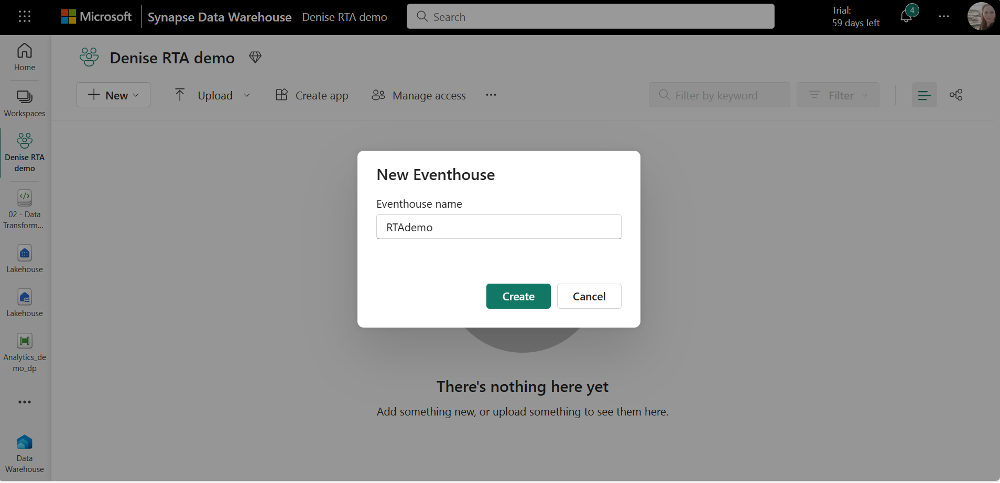
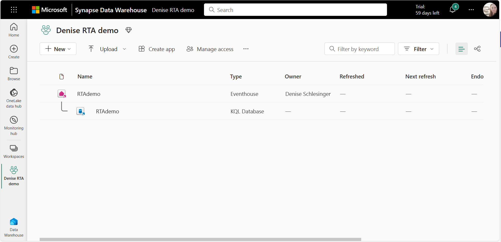

## Accessing your Eventhouse data in a Lakehouse
In this section we will enable an Eventhouse feature called "one logical copy" that allows the KQL DB tables to be accessed from a data lakehouse in parquet format.

When activated, it will constantly copy the KQL data to your Fabric Datalake in delta format. Allowing you to query the data in your KQL database in Delta Lake format using Spark or SQL endpoint on the Lakehouse.
This is the reason we need to activate this feature "before" we load the data into our KQL DB.

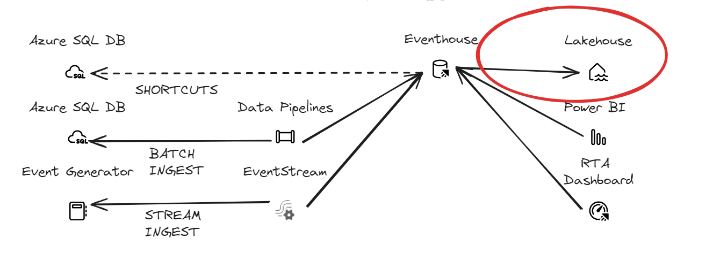

You can read more about this here.  
[Announcing Delta Lake support in Real-Time Analytics KQL Database](<https://support.fabric.microsoft.com/en-us/blog/announcing-delta-support-in-real-time-analytics-kql-db?ft=All>)   

Enabling data availability of KQL Database in OneLake means that customers can enjoy the best of both worlds: they can query the data with high performance and low latency in their KQL database and query the same data in Delta Lake format via any other Fabric engines such as Power BI Direct Lake mode, Warehouse, Lakehouse, Notebooks, and more.

KQL Database offers a robust mechanism to batch the incoming streams of data into one or more Parquet files suitable for analysis. The Delta Lake representation is provided to keep the data open and reusable. This logical copy is managed once, is paid for once and users should consider it a single data set.

Here is how to set this up.  
Click on the pencil icon next to the OneLake availability  
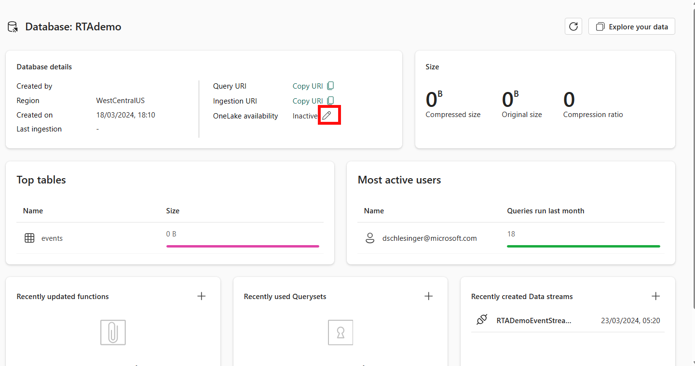
Click active and "Done" button

Build a new Lakehouse called "RTADemoLakehouse"

Click on "Get data" - New shortcut

Select Microsoft OneLake
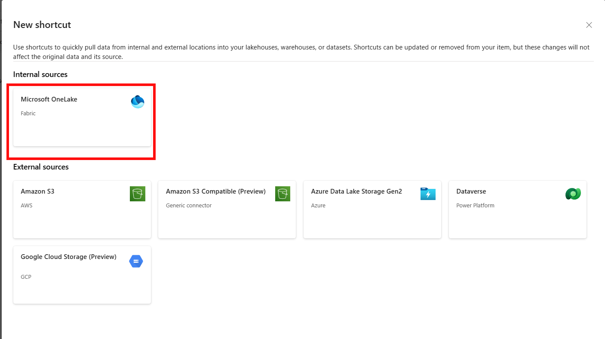
Select all the tables in our Eventhouse KQL DB and click "Next"
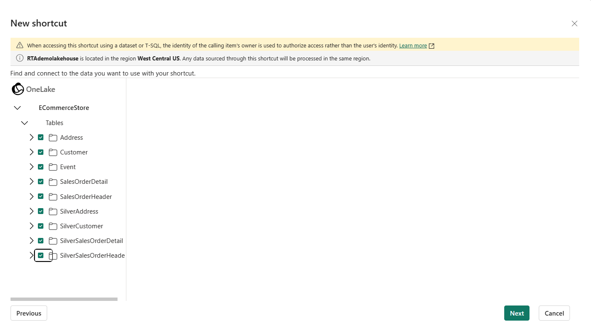
Click "Create"

Now you will have the Eventhouse KQL DB tables available in your Lakehouse. You can query them as any Lakehouse tables


## Create a new Eventstream  
In this section we will be streaming events (impressions and clicks events) generated by a notebook. The events will be streamed into an eventstream and consumed by our Eventhouse KQL DB.


Create an Eventstream called "RTADemoEventStream"  


When we create a "Custom app" as a source, an event hub is created and connected to the EventStream for us.  
Click on the Eventstream source - Custom App to get the event hub endpoint and key to send the events from our notebook.  
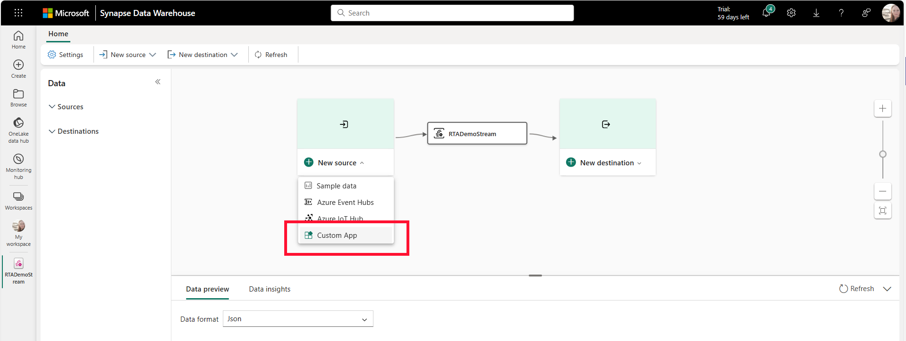
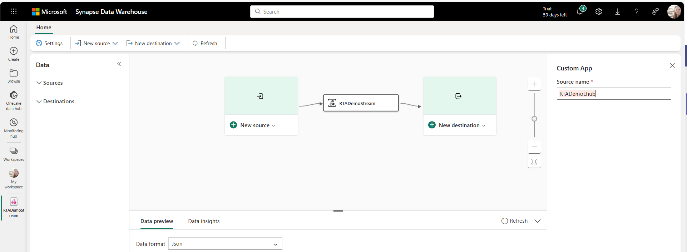  

Click on "Sample code" and copy the connectionString to a notepad
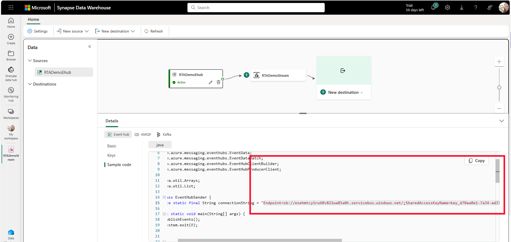

Click on "Keys" and copy the event hub name to a notepad


## Import Data Generator Notebook
Import the [Generate synthetic events notebook](<https://github.com/microsoft/FabricRTA-Retail/blob/main/notebooks/Generate%20synthetic%20events.ipynb>) to generate events using streaming
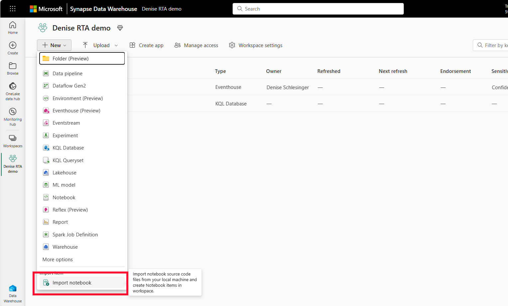


Copy the connectionstring and key you pasted into a notepad in the previous step and paste it in the Notebook first code block


## Run the notebook
Open the "generate synthetic events" notebook in your Fabric Workspace.  
Check the python version is "3.10.12.  
Run all the cells in the notebook to start generating streaming events.  
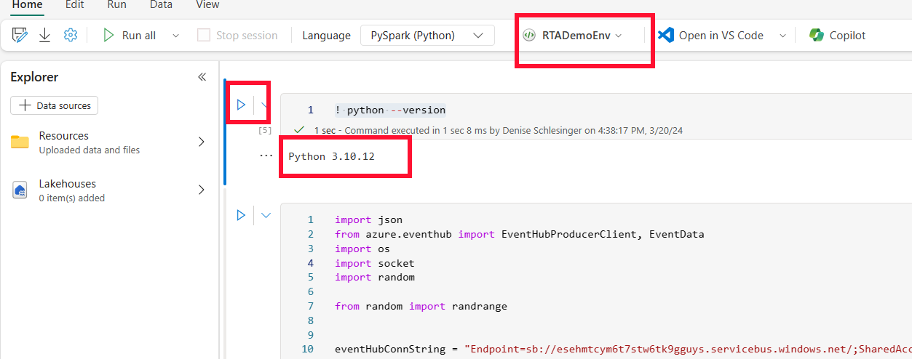

## Define destination in the EventStream
Open the EventStream in your Fabric Workspace.  
Select "New Destination" - KQL Database.  


Select Workspace and the KQL DB we created called "RTADemo"
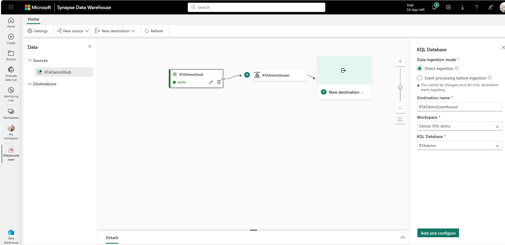

Create a new table in our KQL DB called "Event".  
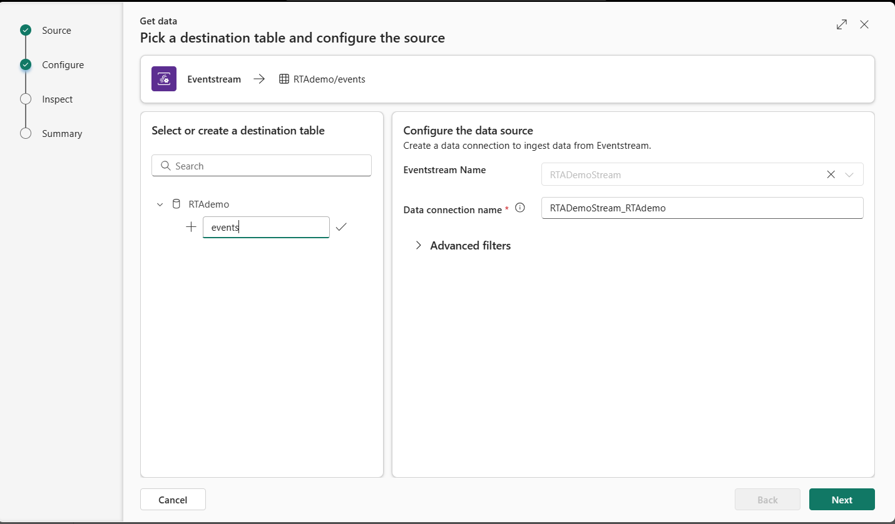

You will see a sample of the streaming data showing click and impression events, Click Finish and Close.  


Now, we can see the EventStream destination is in mode "Ingesting".  


## Build the KQL DB schema
In this section we will create all the tables in our Eventhouse KQL DB.
Two of the tables (product and productCategory) are shortcuts to our SQL DB and the data is NOT being copied into our KQL DB.


Open the RTADemo Eventhouse from your Fabric Workspace.  Click on "Explore your Data".  
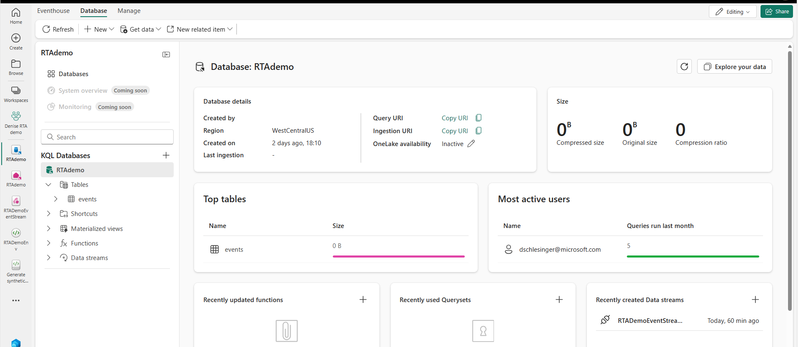


Run the KQL scripts to create all the tables.  
Open the  [createAll.kql](<https://github.com/microsoft/FabricRTA-Retail/blob/main/kql/createAll.kql>) file and copy the entire file content.  

Paste it in the KQL panel in the KQL DB and run it.  


## Data pipeline
In this section we will demonstrate how to use Fabric Data pipelines to copy data from our SQL DB into our Eventhouse KQL DB using batch ingest.
This ingestion type can be a one time ingestion or can be scheduled to run periodically.


Create the Data Pipelines that you can run periodically to copy data to our Eventhouse DB.

Name it "Copy Address table".  
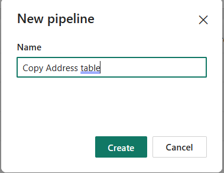

Select the Pipeline Activity - Copy data activity 


Select Source - External and click "+" to create a new connection to the SQL DB


Fill in the details as follows:  
```
servername= adxdemo.database.windows.net
Database name=aworks
UserName=sqlread
Password=ChangeYourAdminPassword1

```


After creating and testing the Data Connection to the SQL DB, select Database and Table "SalesLT.Address".  


Click on "Destination" tab, select "Workspace"- KQL DB - RTADemo - Address as target table.  


Click on "mapping" tab - Import schemas - and make sure all fields are mapped to the correct types with no warnings.  

Click "run" to execute the pipeline.
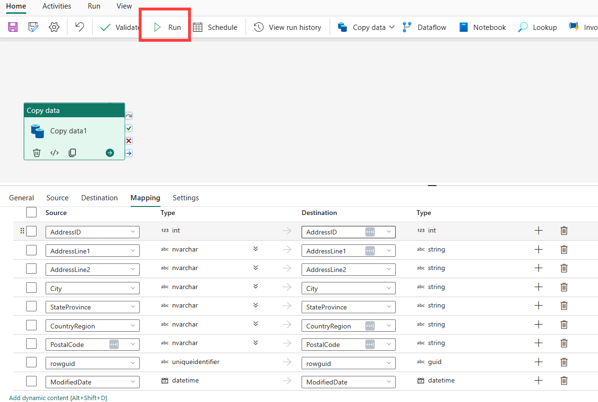

The pipeline will run until you see status "succeeded".


Run the pipeline again by clicking the "Run" button.
We are running the data pipeline twice to show how we are deduping rows.  

Let's check the data we copied.  
Go to our KQL RTADemo Database in your Fabric Workspace.
When running the query - we see 900 rows
```
Address
```
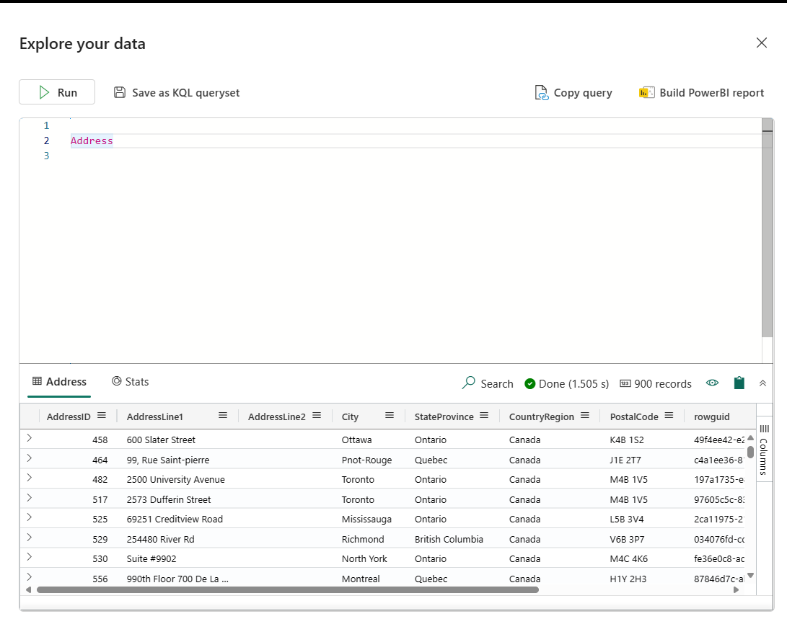  

In the SQL DB (source) we have 450 rows


Now go to our KQL RTADemo Database in your Fabric Workspace.  
Run the following query  
```
SilverAddress
```
We see there are 900 rows and 1 additional column (IngestionDate) 


Run the following query  
```
GoldAddress
```
We see there are 450 rows since the Gold layer contains materialized views using the maximum IngestionDate to show only the latest ingested rows.
```
//GOLD LAYER
// use materialized views to view the latest changes in the orders table
.create materialized-view with (backfill=true) GoldAddress on table SilverAddress
{
    SilverAddress
    | summarize arg_max(IngestionDate, *) by AddressID
}
```


<div class="info" data-title="Note">  

> Repeat all the steps in the Data pipeline creation for the Customer, SalesOrderHeader and SalesOrderDetail.
> Pay attention that the SalesOrderDetail mapping requires you to map money type from SQL to the decimal data type in KQL.  
</div>

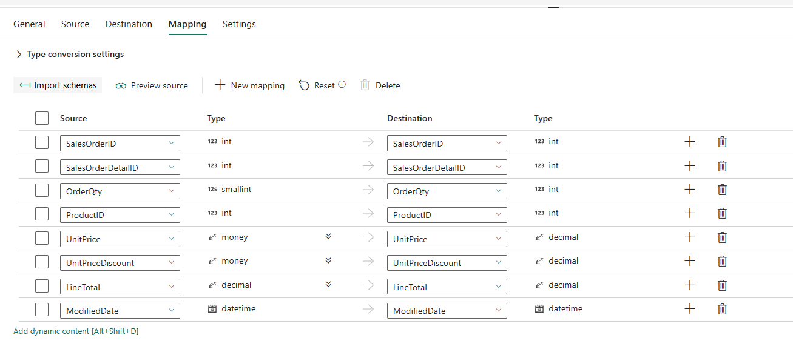

# RTA Dashboard
We will build a real time dashboard to visualize the streaming data.  
It will be refreshed every 30 seconds.
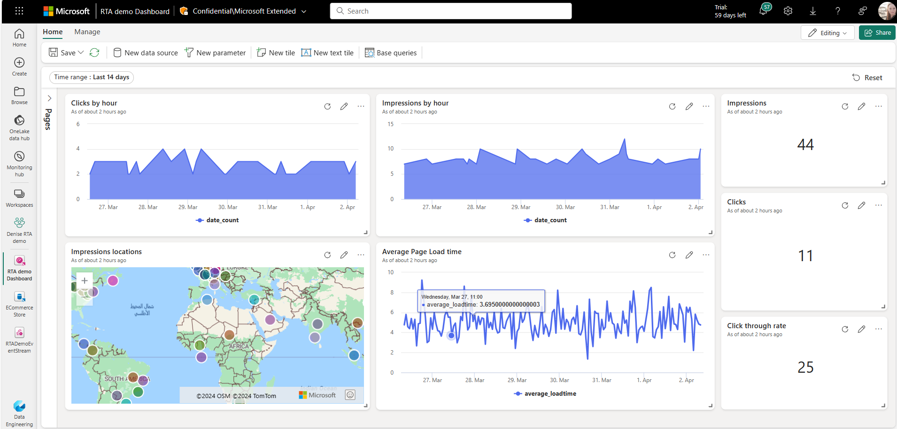

Go to your Fabric Workspace and click on New - More options
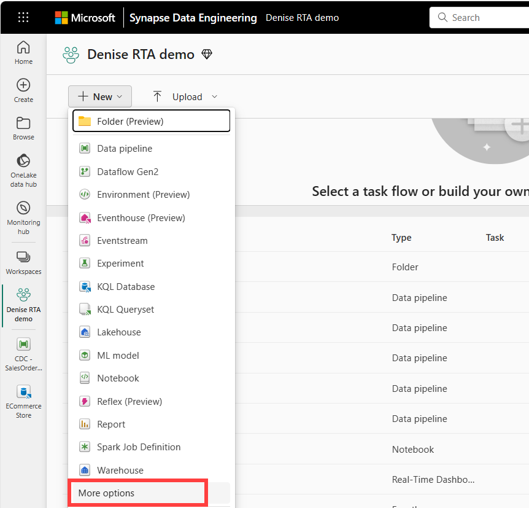

Scroll down and choose Real Time Dashboard
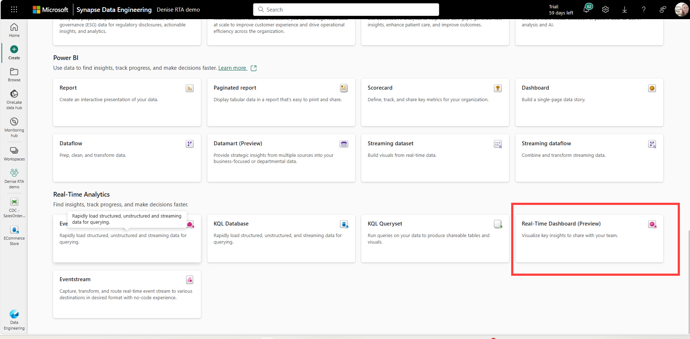
Name it "RTA Dashboard"  
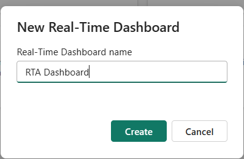
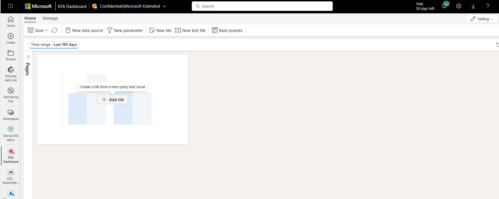

## Define Data source  


## Create all dashboard tiles 
All KQL queries for the tiles can be found in the  [dashboard-RTA.kql](<https://github.com/microsoft/FabricRTA-Retail/blob/main/dashboards/RTA%20dashboard/dashboard-RTA.kql>) file

### Clicks by date 
```
//Clicks by hour
Event 
| where eventDate between (_startTime.._endTime) and eventType == "CLICK" 
| summarize date_count = count() by bin(eventDate, 1h) 
| render timechart  
| top 30 by date_count 
```
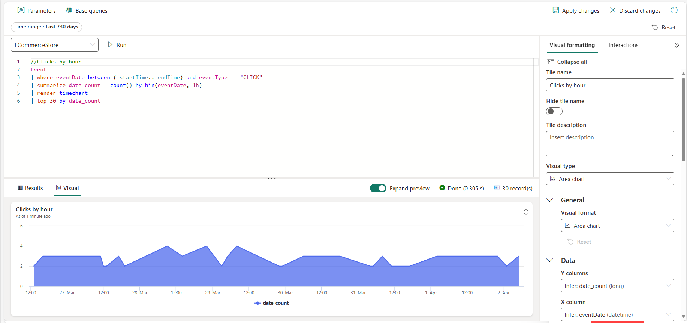
```
//Impressions by hour
Event 
| where eventDate between (_startTime.._endTime) and eventType == "IMPRESSION" 
| summarize date_count = count() by bin(eventDate, 1h) 
| render timechart  
| top 30 by date_count 
```
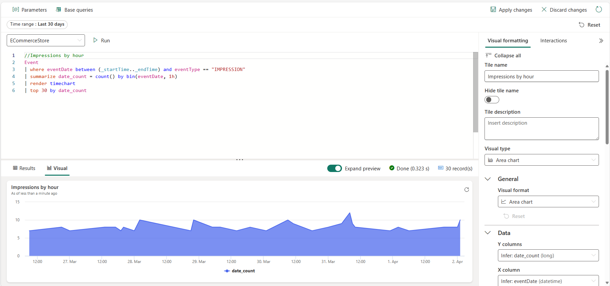
```
//show map of impressions location
Event 
| where eventDate  between (_startTime.._endTime) and eventType == "IMPRESSION" 
| join external_table('products') on $left.productId == $right.ProductID 
| project lon = geo_info_from_ip_address(ip_address).longitude, lat = geo_info_from_ip_address(ip_address).latitude, Name 
| render scatterchart with (kind = map)
```


```
//Average Page Load time
Event 
| where eventDate   between (_startTime.._endTime) and eventType == "IMPRESSION" 
| summarize average_loadtime = avg(page_loading_seconds) by bin(eventDate, 1h) 
| render linechart 
```
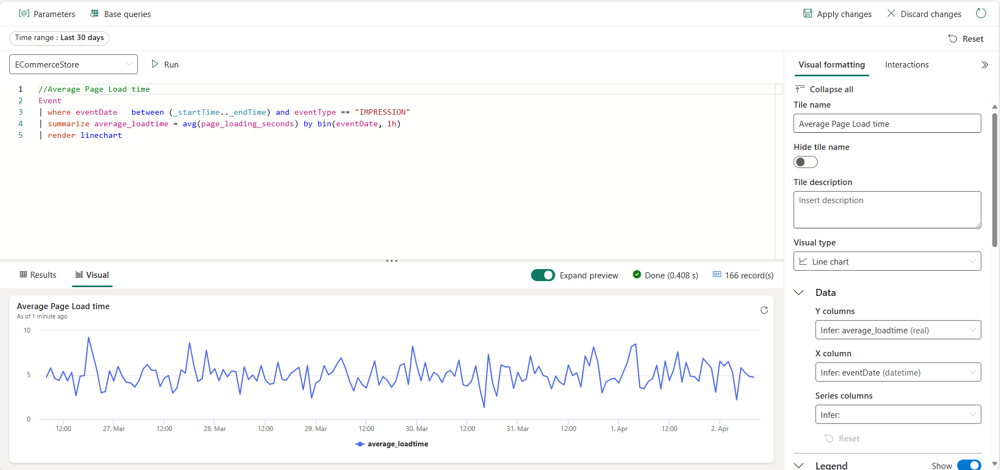
The 3 tiles showing a card with a number use the same query (see below) but show a different field.  
```
let imp =  
Event 
| where eventDate  between (_startTime.._endTime) and eventType == "IMPRESSION" 
| extend dateOnly = substring(todatetime(eventDate).tostring(), 0, 10) 
| summarize imp_count = count() by dateOnly; 
let clck =  
Event 
| where eventDate  between (_startTime.._endTime) and eventType == "CLICK" 
| extend dateOnly = substring(todatetime(eventDate).tostring(), 0, 10) 
| summarize clck_count = count() by dateOnly;
imp  
| join clck on $left.dateOnly == $right.dateOnly 
| project selected_date = dateOnly , impressions = imp_count , clicks = clck_count, CTR = clck_count * 100 / imp_count
```

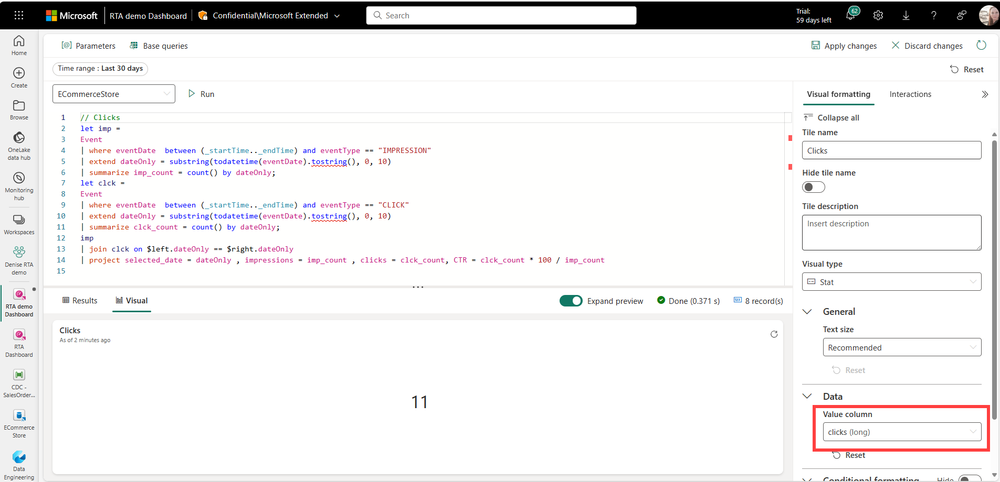


## Stop running the notebook
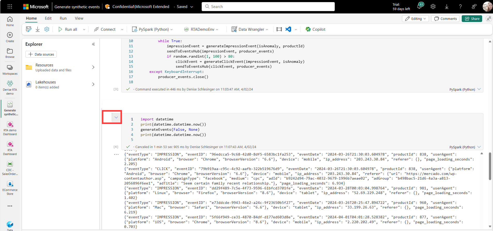

THAT's ALL FOLKS!!  
