# Introduction
Suppose you own an e-commerce website selling bike accessories.  
You have millions of visitors a month, you want to analyze the website traffic, consumer patterns and predict sales.  
This workshop will walk you through the process of building an end-to-end [Real-Time Intelligence](<https://blog.fabric.microsoft.com/en-us/blog/introducing-real-time-intelligence-in-microsoft-fabric>) Solution in MS Fabric, using the medallion architecture, for your e-commerce website.  

You will learn how to:
- Build a medallion architecture in MS Fabric Real-Time Intelligence
- Use Fabric data pipelines for copying data from an operational DB (SQL server with Adventure works sample data)
- Stream events and ingest them into MS Fabric RTI (Real-Time Intelligence) using EventStream
- Create data transformations in Fabric RTI (Real-Time Intelligence)
- Create reports for real-time visualizations using RTI (Real-Time Intelligence) dashboards

All the code in this tutorial can be found here:   
[Building a Medallion Architecture on Fabric Real-Time Intelligence](<https://github.com/microsoft/FabricRTA-Retail/>)  

Also, here's a detailed [article](<https://techcommunity.microsoft.com/t5/startups-at-microsoft/building-a-real-time-medallion-architecture-using-eventhouse-in/ba-p/4110686>) explaining this tutorial.

### Duration
- Lab 1-2 hours (section 8)
- Theoretical context 30-45 minutes (sections 1-6)
- Lab [pre-reqs](<https://moaw.dev/workshop/?src=gh%3Amicrosoft%2FFabricRTA-Retail%2Fmain%2Fdocs%2F&step=6>) 30-45 minutes (section 7, recommend provisioning trial tenan prior if necessary)

### Authors
- [Denise Schlesinger](<https://github.com/denisa-ms>), Microsoft, Prin CSA
- [Hiram Fleitas](<https://aka.ms/hiram>), Microsoft, Sr CSA
- Guy Yehudy, Microsoft, Prin PM

### Feedback - Contributing
- Rate this lab or give us feedback to improve using this short [Eval](<https://forms.office.com/r/xhW3GAtAhi>). Scan this QR Code to open the Eval form on your phone.


- If you'd like to contribute to this lab, report a bug or issue, please feel free to submit a Pull-Request to the [GitHub repo](<https://github.com/microsoft/FabricRTA-Retail/>) for us to review or [submit Issues](<https://github.com/microsoft/FabricRTA-Retail/issues>) you encounter.


---

# What is the Medallion Architecture?
The inspiration for this tutorial was the realization that **Eventhouse** aligns perfectly with the Medallion's architecture requirements. 

The Medallion architecture is a data design pattern with 3 layers:

🥉 The Bronze layer: containing raw data being streamed into a data platform, these are **Eventhouse** continuous ingestion capabilities.  

🥈 The Silver Layer: a curated enriched layer of data, based on transformed data from the Bronze layer. This can be achieved with Eventhouse's **update policies**.   

🥇 The Gold Layer: aggregated data for reporting and BI, this can be achieved with Eventhouse's **materialized views**.  

A medallion architecture (also coined by Databricks) is a data design pattern used to logically organize data. The goal is to **incrementally** improve the structure and quality of data as it flows through each layer of the architecture. Medallion architectures are sometimes also referred to as "multi-hop" architectures.

Creating a multi-layer data platform allow companies to improve data quality across the layers and at the same time provide for their business needs. Unstructured and raw data are ingested using scalable pipelines to output the highest quality enriched data.

Reference: [Data Engineering Wiki](<https://dataengineering.wiki/Concepts/Medallion+Architecture>)

In summary, Microsoft Fabric [Real-Time Intelligence (RTI)](<https://aka.ms/fabric-docs-rta>) features benefit building a medallion architecture. They provide minimal latency for data in-motion, automatic light-weight transformations, dashboards, copilots to help you derive insights in a no-code experience, and allow you to take actions in real-time over your data. Additionally, all data is made avaiable via OneLake in delta-parquet format to Lakehouses using OneLake Availability as OneLogical copy for all your data. 

---

# Fabric Real-Time Intelligence features 

Let's cover the key-features and how we plan to use them for our architecture.

### Event streams
- Clicks and Impressions events are ingested from an Eventstream into the `events` table. This feature allows us to bring real-time events into Fabric, transform them, and then route them to various destinations wihtout writing any code (no-code). Enhanced capabilities allows us to source data into Eventstreams from Azure Event Hubs, IoT Hubs, Azure SQL Database (CDC), PostgreSQL Database (CDC), MySQL Database (CDC), Azure Cosmos DB (CDC), Google Cloud Pub/Sub, Amazon Kinesis Data Streams, Confluent Cloud Kafka, Azure Blog Storage events, Fabric Workspace Item events, Sample data or Custom endpoint (Custom App).
- Feature [documentation](<https://learn.microsoft.com/fabric/real-time-analytics/event-streams/overview>).

### Copilot
- Copilot for Real-Time Intelligence is an advanced AI tool designed to help you explore your data and extract valuable insights. You can input questions about your data, which are then automatically translated into Kusto Query Language (KQL) queries. Copilot streamlines the process of analyzing data for both experienced KQL users and citizen data scientists.
- Feature [documentation](<https://learn.microsoft.com/fabric/get-started/copilot-real-time-intelligence>)

### Data pipelines 
- Bronze layer tables are populated by a Data Factory pipeline to copy data from our operational SQL DB.
- Feature [documentation](<https://learn.microsoft.com/fabric/data-factory/tutorial-end-to-end-pipeline>).

### Shortcuts
- `Product` and `ProductCategory` SQL tables are defined as external tables (Fabric shortcuts). Meaning the data is not copied but served from the SQL DB itself. Shortcuts allow data to remain stored in outside of Fabric like in our operational SQL DB, yet presented in Fabric as a central location.
- Shortcuts enable us to create live connections between OneLake and existing target data sources, whether internal or external to Azure. This allows us to retrieve data from these locations as if they were seamlessly integrated into Microsoft Fabric.
- A shortcut is a schema entity that references data stored external to a KQL database in your cluster. In Lakehouses, Eventhouses, or KQL Databases it's possible to create shortcuts referencing Internal locations within Microsoft Fabric, ADLS Gen2, Spark Notebooks, AWS S3 storage accounts, or Microsoft Dataverse.
- From my perspective, I value the fact that all data is aligned under a unified namespace, allowing seamless access through the same ADLS Gen2 APIs, even when sourced from AWS S3. By enabling us to reference different storage locations, OneLake's Shortcuts provides a unified source of truth for all our data within the Microsoft Fabric environment and ensures clarity regarding the origin of our data.
- Feature [documentation](<https://learn.microsoft.com/fabric/real-time-analytics/onelake-shortcuts?tabs=onelake-shortcut>).

### Eventhouse
- The Eventhouse can host multiple KQL Databases for easier management. It will store relational data from an operational SQL DB, levergage shortcuts and automate transformations in real-time.
- The Eventhouse is the best place to store streaming data in Fabric. It provides a highly-scalable analytics system with built-in Machine Learning capabilities for discrete analytics over high-granular data. It's useful for any scenario that includes event-based data, for example, telemetry and log data, time series and IoT data, security and compliance logs, or financial records. The Eventhouse supports Kusto Query Languanguage (KQL) queries, T-SQL queries and Python. The data is automatically made available in delta-parquet format and can be easily accessed from Notebooks for mroe advanced transformaitons. The Eventhouse is **specifically tailored** to time-based, streaming or batch events with structured, semistructured, and unstructured data.
- Feature [documentation](<https://learn.microsoft.com/fabric/real-time-intelligence/eventhouse>).

### KQL Update policies
- This feature is also known as a mini-ETL. Update policies are automation mechanisms triggered when new data is written to a table. They eliminate the need for special orchestration by running a query to transform the ingested data and save the result to a destination table. Multiple update policies can be defined on a single table, allowing for different transformations and saving data to multiple tables simultaneously. **Target** tables can have a different schema, retention policy, and other policies than the **Source** table. The data in derived silver layer tables (targets) of our medallion architecture is inserted upon ingestion to bronze tables (sources). Based on Kusto's update policy feature, this allows to append transformed rows in real-time to a target table as data is landing in a source table and can also be set to run in a transaction. Meaning if the data from bronze fails to be transformed to silver, it will not be loaded to bronze either, by default this is set to off allowing maximum throughput.
- Feature [documentation](<https://learn.microsoft.com/azure/data-explorer/kusto/management/update-policy>).

### KQL Materialized Views
- Materialized views expose an aggregation query over a source table, or over another materialized view. We will use materialized views to create the Gold Layer in our medallion architecture. Most common materialized views provide the current reading of a metric or statistics of metrics over time. They can also be backfilled with historial data; however, by default they are automatically populated by newly ingested data.
- Feature [documentation](<https://learn.microsoft.com/azure/data-explorer/kusto/management/materialized-views/materialized-view-overview>).

### One Logical Copy
- Creates a one logical copy of KQL Database data by turning on OneLake availability. Turning on OneLake availability for your KQL tables, database or Eventhouse means that you can query the data in your KQL database in Delta Lake format via other Fabric engines such as Direct Lake mode in Power BI, Warehouse, Lakehouse, Notebooks, and more. When activated, it will copy via mirroring the KQL data to your Fabric Datalake in delta-parquet format. Allowing you to shortcut tables from your KQL Database via OneLake to your Fabric Lakehouse, Data Warehouse, and also query the data in delta-parquet format using Spark Notebooks or the SQL-endpoint of the Lakehouse.
- Feature [documentation](<https://learn.microsoft.com/fabric/real-time-analytics/one-logical-copy>).

### KQL Dynamic fields
- Dynamic fields are a powerful feature of Eventhouse / KQL DB that support evolving schema changes and object polymorphism, allowing to store different event types that have a common denominator of base fields.
- Feature [documentation](<https://learn.microsoft.com/azure/data-explorer/kusto/query/scalar-data-types/dynamic>).

### Kusto Query Language (KQL)
- KQL commands will be automatically written by the Get Data UI wizard when configuring the Eventhouse KQL Database destination in Eventstream. The commands will create the `events` table and JSON mapping. Secondly, the control commands will be issued in a database script that automate creation of additional schema items such as Tables, Shortcuts, Functions, Policies and Materialized-Views.
- KQL is also known as the language of the cloud. It's available in many other servies such as Microsoft Sentinel, Azure Monitor, Azure Resource Graph and Microsoft Defender. The code-name **Kusto** engine was invented by 4 engineers from the Power BI team over 10 years ago and has been implemented across all Microsoft services including Github Copilot, LinkedIn, Azure, Office 365, and XBOX.
- KQL queries are easy to write, read and edit. The language is most commonly used to analyze logs, sign-on events, application traces, diagnostics, signals, metrics and much more. Supports multi-statement queries, relational operators such as filters (where clauses), union, joins aggregations to produce a tabular output. It allows the ability to simply pipe (|) additional commands for ad-hoc analytics without needing to re-write entire queries. It has similaries to PowerShell, Excel functions, LINQ, function SQL, and OS Shell (Bash). It supports DML statements, DDL statements (referred to as Control Commands), built-in machine learning operators for forecasting & anomaly dectection, plus more... including in-line Python & R-Lang.
- Feature [documentation](<https://learn.microsoft.com/azure/data-explorer/kusto/query/>).

### Real-time Dashboards
- Will contain a collection of visual tiles _Click Through Rate_ stat KPIs, _Impressions_ area chart, _Clicks_ area chart, _Impressions by Location_ map for geo-spatial analytics and _Average Page Load Time_ in a line chart. This feature support filter parameters, additional pages, markdown tiles, inlcuding Plotly, multiple KQL datasources, base queries, embedding. Supports sharing with permissions controls, setting an Alert by leveraging Data Activator for actions, and automatic refresh with a minimum frequency of 30 seconds. These dashboards are commonly used for Operations and Power BI is commonly used for Business Intelligence. Power BI supports more advanced visualizations and rich data-story capabilities. Real-time Dashboards refresh very fast and allow with ease to togle between visual analytist to pro-developer that can explore queries or edit without needing to download a desktop tool. They make the experience simpler for analysts to visualize over high-granular data.
- Feature [documentation](<https://learn.microsoft.com/fabric/real-time-intelligence/dashboard-real-time-create>).

### Data Activator
- We will to Set an Alert in our Real-time Dashboard to message me in Teams. Data Activator (code-name Reflex) is a no-code experience in Microsoft Fabric for automatically taking actions when patterns or conditions are detected in changing data. It monitors data in Power BI reports, Eventstreams items and Real-time Dashboards, for when the data hits certain thresholds or matches other patterns. It then automatically takes appropriate action such as alerting users or kicking off Power Automate workflows.
- Some common use cases are:
  - Run Ads when same-store sales decline.
  - Alert store managers to move food from failing freezers before it spoils.
  - Retain customers who had a bad experience by tracking their journey through apps, websites etc.
  - Help logistics companies find lost shipments proactively by starting an investigation when package status isn't updated for a certain length of time.
  - Alert account teams when customers fall behind with conditional threasholds.
  - Track data pipeline quality, to either re-run jobs, alert for detected failures or anomalies.
- Feature [documentation](<https://learn.microsoft.com/fabric/data-activator/data-activator-introduction>).

---

# The e-commerce store   

The e-commerce store database entities are:  
- **Product:** the product catalog. 
- **ProductCategory:** the product categories.  
- **Customer:** the customers that purchased items in the store.
- **Address:** the addresses of the customers.
- **SalesOrderHeader:** the metadata for the orders.
- **SalesOrderDetail:** every item purchased in an order.
- **events:** a click or impression event.   
  - An **impression event** is logged when a product appears in the search results.
  
  - A **click event** is logged when the product is clicked and the customer has viewed the details.  
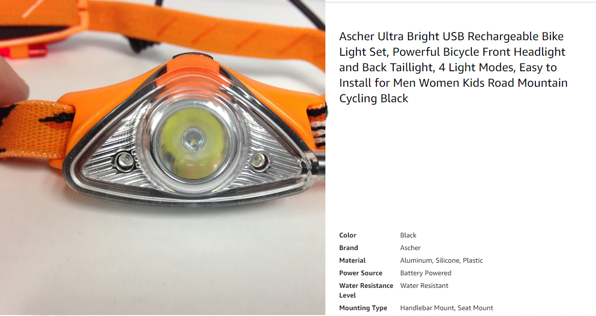  

Photo by <a href="https://unsplash.com/@himiwaybikes?utm_content=creditCopyText&utm_medium=referral&utm_source=unsplash">Himiway Bikes</a> on <a href="https://unsplash.com/photos/black-and-gray-motorcycle-parked-beside-brown-wall-Gj5PXw1kM6U?utm_content=creditCopyText&utm_medium=referral&utm_source=unsplash">Unsplash</a>  
Photo by <a href="https://unsplash.com/@headaccessories?utm_content=creditCopyText&utm_medium=referral&utm_source=unsplash">HEAD Accessories</a> on <a href="https://unsplash.com/photos/silver-and-orange-head-lamp-9uISZprJdXU?utm_content=creditCopyText&utm_medium=referral&utm_source=unsplash">Unsplash</a>  
Photo by <a href="https://unsplash.com/@jxk?utm_content=creditCopyText&utm_medium=referral&utm_source=unsplash">Jan Kopřiva</a> on <a href="https://unsplash.com/photos/a-close-up-of-a-helmet-with-sunglasses-on-it-CT6AScSsQQM?utm_content=creditCopyText&utm_medium=referral&utm_source=unsplash">Unsplash</a>
  

---

# Architecture

## Components of Fabirc's Real-Time Intelligence

Real-Time Intelligence allows organizations to ingest, process, analyze, ask questions over your data using natural language, transform and automatically act on data. All with a central hub (Real-Time Hub) to easily access and visualize all internal and external, first- and third-party streaming data. We can achieve faster, more accurate decision-making and accelerated time to insight.

## Lab Architecture

Now with Data Activator (Reflex), we can also set alerts on Real-time Dashboards to send a message in Teams with conditional threasholds or even more advanced actions. 

---

# Data schema

## Data flow
  


## Tables
| Table| Origin     | Description|
|------|------------|------------|
| **events**|EventHouse table|Streaming events representing the product being seen or clicked by the customer. Will be streamed into Fabric Eventhouse from an eventstream. We'll use a Fabric Notebook to simulate and push synthetic data (fake data) into an endpoint.|
| **Customer**| Copied using Pipeline| Describes customers and their geographic location|
| **Address**| Copied using Pipeline|Customers addresses|
| **SalesOrderHeader**| Copied using Pipeline|Information about sales orders|
| **SalesOrderDetail**| Copied using Pipeline|Detailed information about sales orders, including product IDs and quantities sold|
| **SilverCustomer**|EventHouse table|Table created based on an update policy with **transformed data**|
| **SilverAddress**|EventHouse table|Table created based on an update policy with **transformed data**|
| **SilverOrdersHeader**|EventHouse table|Table created based on an update policy with transformed data|
| **SilverOrdersDetail**|EventHouse table|Table created based on an update policy with transformed data|

## External Tables
| Table| Origin     | Description|
|------|------------|------------|
| **Product**|**Shortcut** to SQL DB|Products, including descriptions and prices|
| **ProductCategory**|**Shortcut** to SQL DB|Product category|

## Functions
| Function| Description|
|------------|------------|
|**ParseAddress**|Adds watermark column based on `ingestion_time()`|
|**ParseCustomer**|Adds watermark column based on `ingestion_time()`|
|**ParseSalesOrderHeader**|Adds calculated column `DaysShipped` by measuring the number of days between `ShipDate` and `OrderDate`. Also, adds watermark column based on `ingestion_time()` |
|**ParseSalesOrderDetail**|Adds watermark column based on `ingestion_time()`|

## Materialized-Views
| View | Origin     | Description|
|------|------------|------------|
| **GoldAddress**|EventHouse silver table|Materialized view showing only the **latest** changes in the source table showing how to handle duplicate or updated records|
| **GoldCustomer**|EventHouse silver table|Materialized view showing only the **latest** changes in the source table showing how to handle duplicate or updated records|
| **GoldSalesOrderHeader**|EventHouse silver table|Materialized view showing only the **latest** changes in the source table showing how to handle duplicate or updated records|
| **GoldSalesOrderDetail**|EventHouse silver table|Materialized view showing only the **latest** changes in the source table showing how to handle duplicate or updated records|

---

# Pre-requisites
- Recommended material to review (at least one) prior to this lab, however it's not required:
  - https://aka.ms/learn.kql
  - [Real-Time Intelligence Tutorial](<https://learn.microsoft.com/fabric/real-time-intelligence/tutorial-introduction>)
- To complete the lab you **must** have access to a [Microsoft Fabric](<https://www.microsoft.com/microsoft-fabric/getting-started>) workspace with at least Contributor permissions.

### Trial Tenant for the Lab
If you need a new Trial Tenant to complete the lab, suggest to register a new Outlook.com email and follow these steps:
1. [Provision Fabric Trial Tenant](<https://github.com/microsoft/FabricRTA-in-a-Day/tree/main/assets/trialtenant>) - see document and powershell script to setup a lab admin.
   - 25 workspaces with access to 25 logins will be created automatically (one workspace per user).
   - Participants should create items in the workspace designated to their own login.
   - If more than 25 accounts are necessary, addtional Trial Tenants can be provisioned by repeating this process again. Also, participants can share the lab credentials and use folders in their workspaces. 
3. [Office 365 E5 Trial](<https://blog.fabric.microsoft.com/blog/accessing-microsoft-fabric-for-developers-startups-and-enterprises>). ⚠️ Make sure to disable recurring billing, otherwise your credit card will be charged for Office E5.
4. The "LabAdmin" credential should be used by the lab proctor.
5. The "LabAdmin" can have the pre-built lab items for Lab Users 01-24 to reference as a cheatsheet. To do so, grant Users 01-24 viewer permission to the "LabAdmin" workspace.
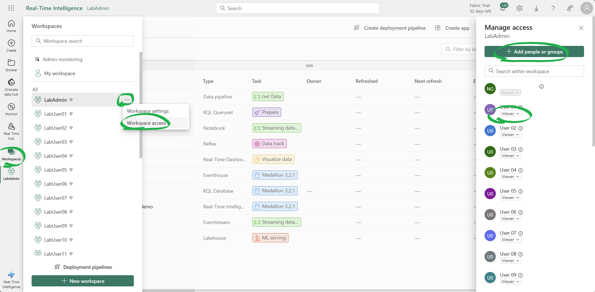

---

# Building the platform
## 1. Login to Lab Enviroment
1. Proceed to [app.fabric.microsoft.com](<https://app.fabric.microsoft.com/>)
2. Login with provided credentials, if a trial fabric tenant was previously setup (reference Pre-reqs). You may also choose to run the lab in your own Fabric Tenant if you already have one
3. Click **Real-Time Intelligence**.


## 2. Fabric Workspace 
1. Click **Workspaces** on the left menu and open the Fabric Workspace **designated** to your login by the Fabric Trial Tenant.
2. (Optional) If using your own Fabric Tenant, create a new workspace for this lab. 


## 3. Create a new Eventhouse  
1. Create an Eventhouse called "RTAdemo"  


<div class="info" data-title="Note">
  
> The [Eventhouse](<https://learn.microsoft.com/en-us/fabric/real-time-intelligence/eventhouse>) is designed to handle real-time data streams efficiently, which lets organizations ingest, process, and analyze data in near real-time. Event houses are particularly useful for scenarios where **timely insights are crucial**. Event houses provide a scalable infrastructure that allows organizations to handle growing volumes of data, ensuring optimal performance and resource use. Event houses are the **preferred** engine for semistructured and free text analysis . An event house is a workspace of databases, which might be shared across a certain project. It allows you to manage multiple databases at once, sharing capacity and resources to optimize performance and cost. Event houses provide unified monitoring and management across all databases and per database. Event houses are **specifically tailored** to time-based, streaming events with structured, semistructured, and unstructured data. You can get data from multiple sources or pipelines (For example, Eventstream, SDKs, Kafka, Logstash, data flows, and more) and multiple data formats. This data is automatically indexed and partitioned based on ingestion time.
</div>

## 4. Create a new Eventstream 
In this section we will be streaming events (impressions and clicks events) generated by a notebook. The events will be streamed into an eventstream and consumed by our Eventhouse KQL DB.
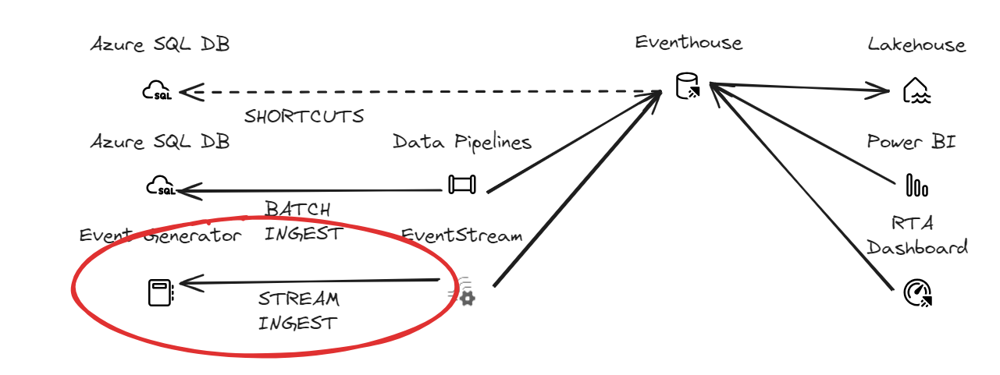

1. Create an Eventstream called "RTADemoEventStream"  


2. For this lab, you **do not** need to check the box to enable Preview Features. If you enable the preview features you may proceed just as well, but some prompts may differ in the Eventstream User-Interface.
3. Add a "Custom app" or "Custom Endpoint" as a source. This will create an event hub connected to the Eventstream. Name the new source "CustomApp" or as you prefer. 

4. Click on the Eventstream source - Custom App to get the "Event hub name" and "Connection string-primary key". We need these values to send the events from our Notebook.  
5. Click on "Keys"
6. Click the copy icon next to the **Event hub name** to copy it to a notepad.

7. Click the view icon at the end of the **Connection string** (primary or secondary) to see it.
8. Then, click the copy icon at the end of **Connection string** to copy it to a notepad. It must be visible in order to copy it.

## 5. Import Data Generator Notebook
1. Import the notebook file [Generate synthetic events.ipynb](<https://github.com/microsoft/FabricRTA-Retail/blob/main/notebooks/Generate%20synthetic%20events.ipynb>) to generate events using streaming.
2. From GitHub, click the "Download raw file" icon on the top right.
3. Then proceed to import the notebook file to your Fabric workspace.


## 6. Run the notebook
1. Open the "Generate synthetic events" notebook in your Fabric Workspace.
2. Paste your `eventHubConnString` value and `eventHubNameevents` value using the values your copied from the previous step - Eventstream keys.
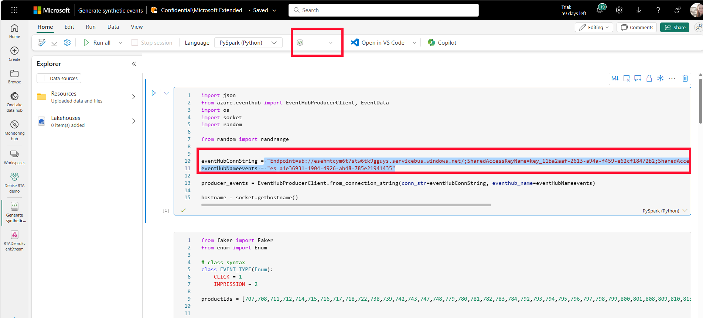
4. Click **Run all** at the top left to start generating streaming events. 
5. Wait a few minutes for the first code cell to finish and it will proceed to next code cells automatically.
6. Scroll down to the last code cell and it should begin to print the generated syntetic events in JSON format.


## 7. Define destination in the Eventstream
1. Open the Eventstream in your Fabric Workspace.
2. Select "New Destination" - KQL Database.  

3. Select your workspace and the KQL Database we created called "RTADemo".

5. Create a new table in our KQL DB called `events`.

6. You will see a sample of the **streaming** data showing CLICK and IMPRESSION events, click Finish and Close.
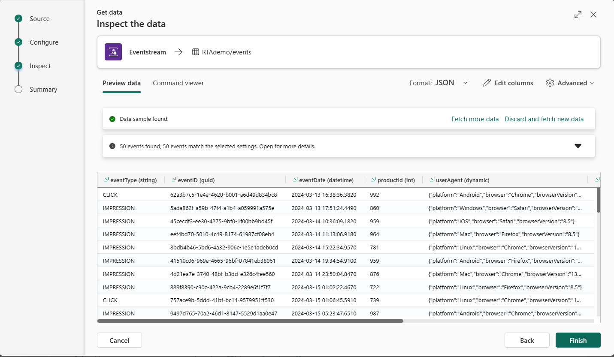
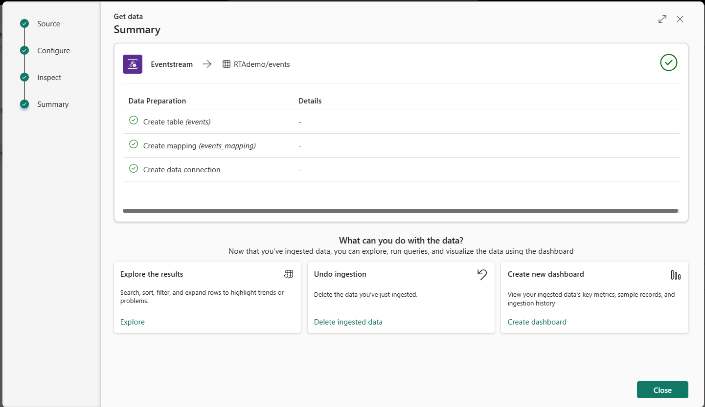
7. You should see the Eventstream destination is in mode "Ingesting" or "Streaming". You may need to click Publish prior and the Refresh button. 
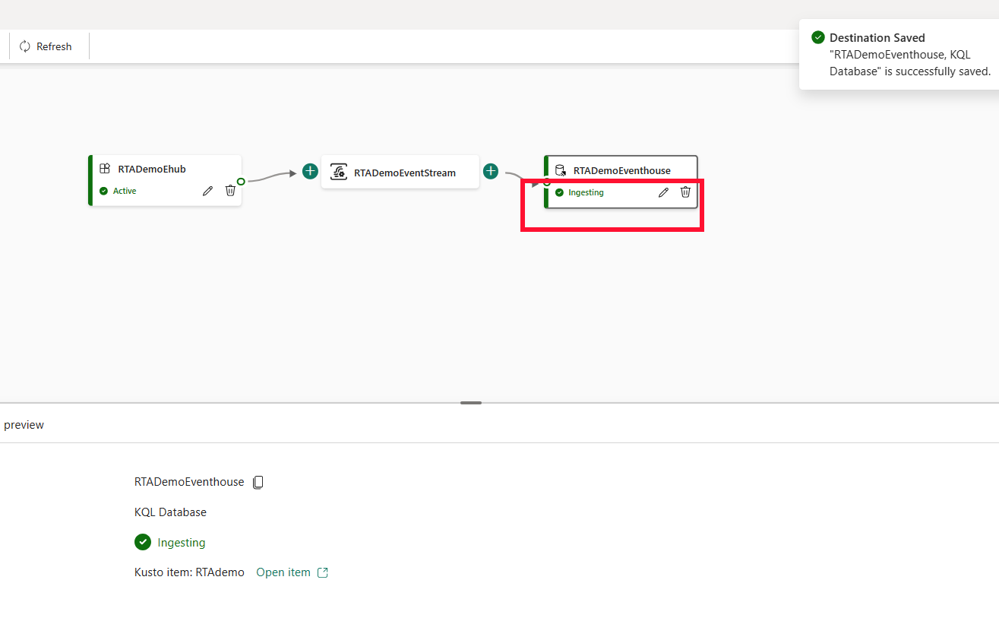
8. (Optional) The **Real-Time Hub** menu icon on the left, provides a simple way to **Get Events** from several sources and samples. 
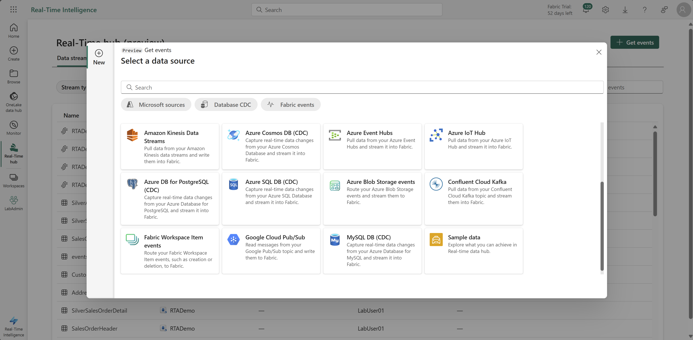

## 8. Accessing your Eventhouse data in a Lakehouse
This feature is also called "one logical copy" and it automatically allows KQL Database tables to be accessed from a Lakehouse, Notebooks, etc in delta-parquet format via OneLake.
- When activated it will constantly copy the KQL data to your Fabric OneLake in delta format. It allows you to query KQL Database tables as delta tables using Spark or SQL endpoint on the Lakehouse. We recommend enabling this feature "before" we load the more data into our KQL Database. Also, consider this feature can be enabled/disabled per table if necessary. You can read more about this feature here: [Announcing Delta Lake support in Real-Time Intelligence KQL Database](<https://support.fabric.microsoft.com/blog/announcing-delta-support-in-real-time-analytics-kql-db?ft=All>).
- Enabling data availability of KQL Database in OneLake means you can enjoy the best of both worlds. (1) Query the data with high-performance and low-latency in the KQL database and (2) Query the same data in Delta Lake format via any other Fabric engines such as Power BI Direct Lake mode, Warehouse, Lakehouse, Notebooks, and more.
- KQL Database offers a robust mechanism to batch the incoming streams of data into one or more Parquet files suitable for analysis. The Delta Lake representation is provided to keep the data open and reusable. This logical copy is managed once, is paid for once and users should consider it a single data set.


### Here's how to set this up
1. Open your Eventhouse
2. Select your KQL Database
3. Click on the pencil icon next to OneLake availability in the Database details pane.

4. Click the toggle to activate it and click Done.
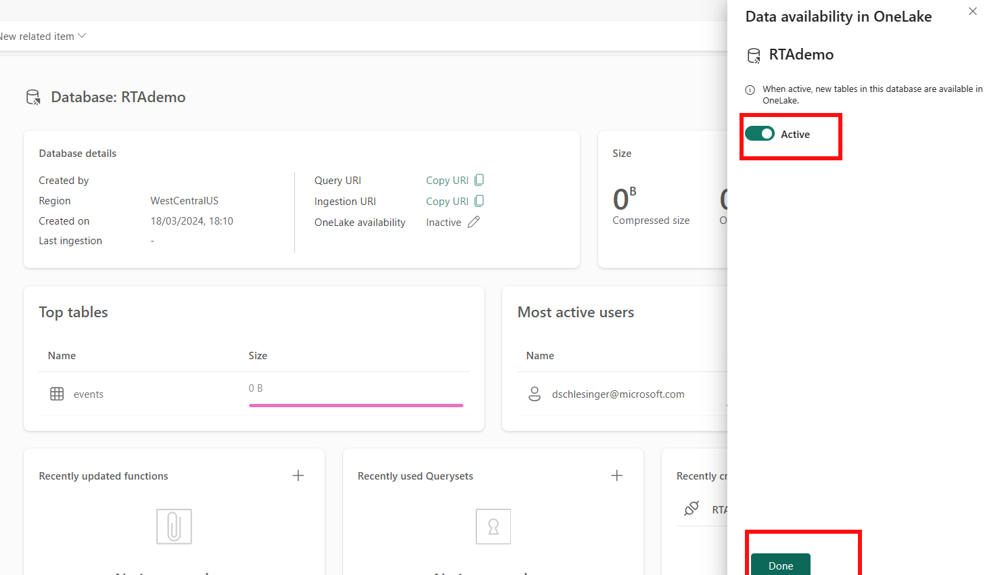
5. Create new Lakehouse called "RTADemoLakehouse" in your workspace.
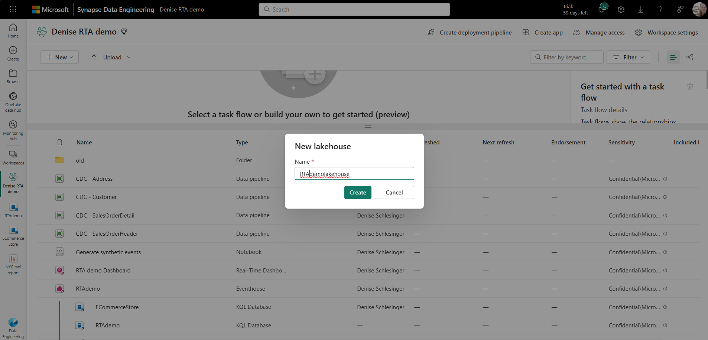
6. Click on "Get data" drop down, choose **New shortcut**
7. 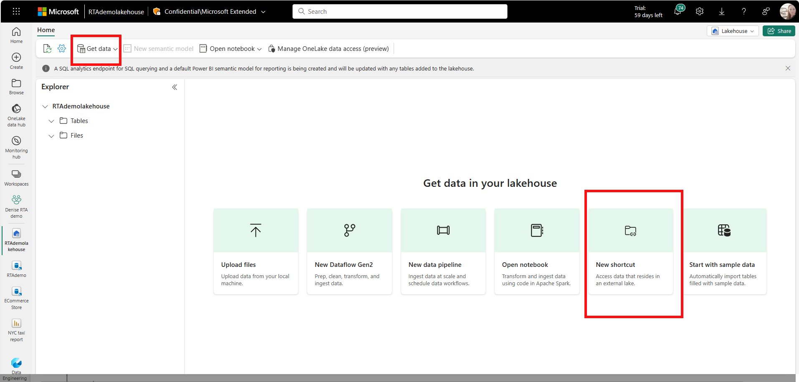
8. Select Microsoft OneLake

9. Select the "events" table in our Eventhouse KQL DB and click "Next". 

<div class="info" data-title="Note">
  
> You may return to this step to create additional shortcuts, after running the [createAll.kql](<https://github.com/microsoft/FabricRTA-Retail/blob/main/kql/createAll.kql>) database script which will create the additional tables. For now, you may proceed by selecting just the "events" table.
</div>


10. Click "Create"
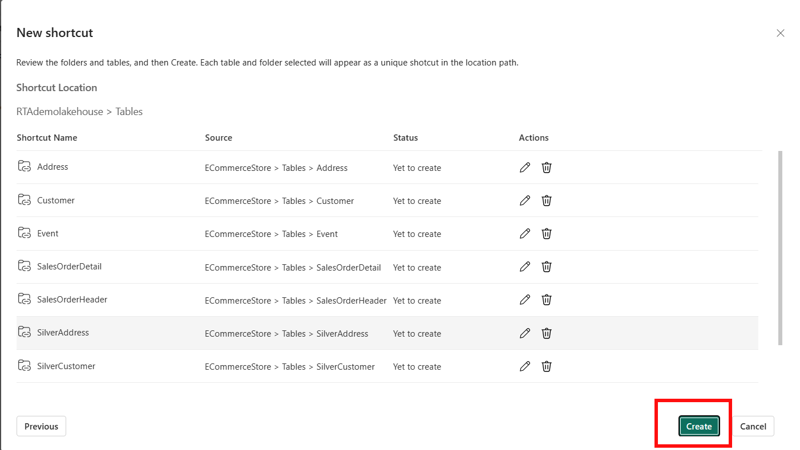
11. Now you will have the Eventhouse KQL Database tables available in your Lakehouse. This also works across workspaces. You can query them like any other Lakehouse table.
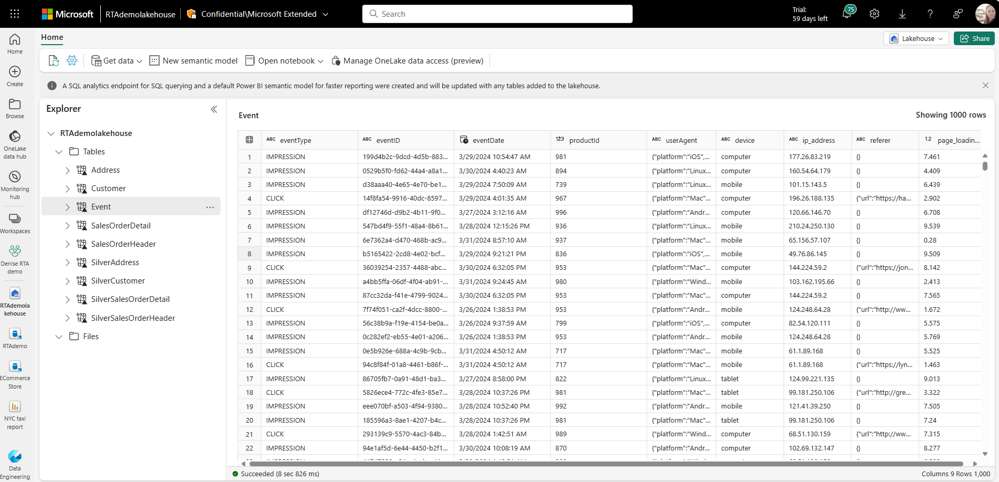


## 9. Build the KQL DB schema
In this section we will create all the tables, functions, materialized-views, and enable update policies and in our Eventhouse KQL Database. Two of the tables (product and productCategory) are shortcuts to our SQL DB and the data is NOT being copied into our KQL DB.
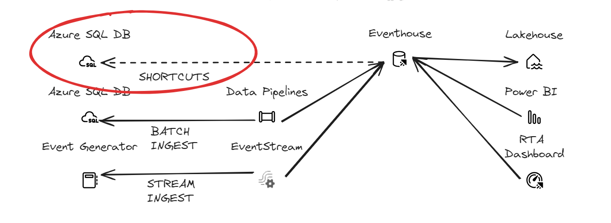

1. Open the RTADemo KQL Database in the Eventhouse of your Fabric Workspace.
2. Click on "Explore your Data".  
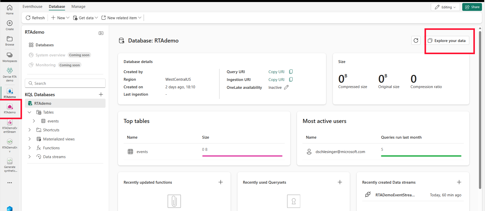
3. Open the [createAll.kql](<https://github.com/microsoft/FabricRTA-Retail/blob/main/kql/createAll.kql>) file in GitHub and click copy icon at the top right to copy the entire file content.
4. Replace all on the "Explore your data" by deleting lines 1-19 and paste the contents of the createAll.kql file.  
5. Click Run

7. Click Save as KQL queryset, name it "createAll".
8. You can add additional tabs in the KQL Queryset to add new queries.
9. Your tables, functions, shortcuts and materialized views should appear on the database pane on the left.

9. (Optional) While on the KQL Database details screen you may explore additional **Real-Time Intelligence Samples** by clicking the **drop-drop next to Get data** and selecting a desired sample. These samples give you the ability to learn more. 
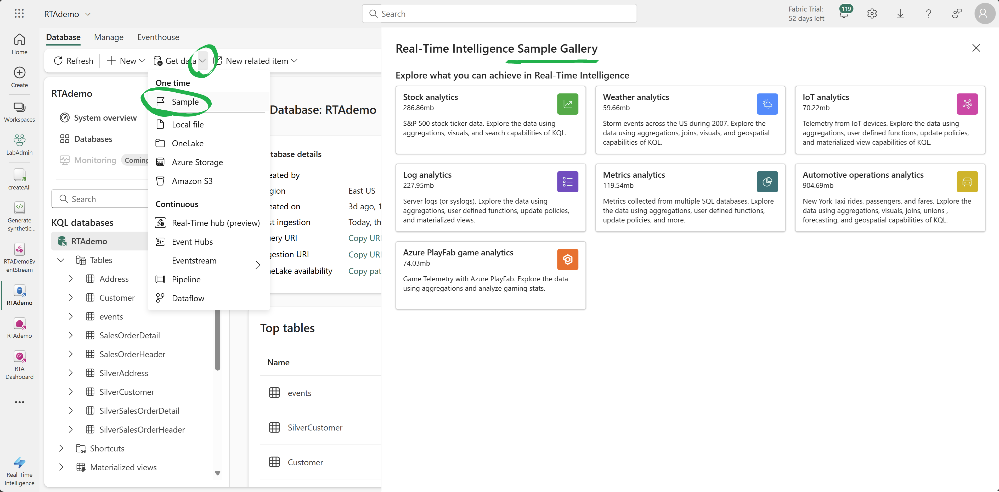


## 10. Data Pipeline
In this section we will demonstrate how to use Fabric Data Factory pipeline to copy data from our SQL DB into our Eventhouse KQL DB via **batch** ingestion. This type of ingestion can be a one-time thing or scheduled to run periodically.
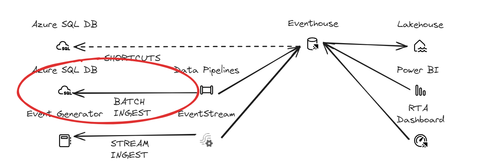

1. Create the Data Pipelines that you can run periodically to copy data to our Eventhouse DB.

2. Name it "Copy Address table".  

3. Select the Pipeline Activity - **Copy data** activity 

4. Set the **Source** to External and click "+ New" to create a new connection
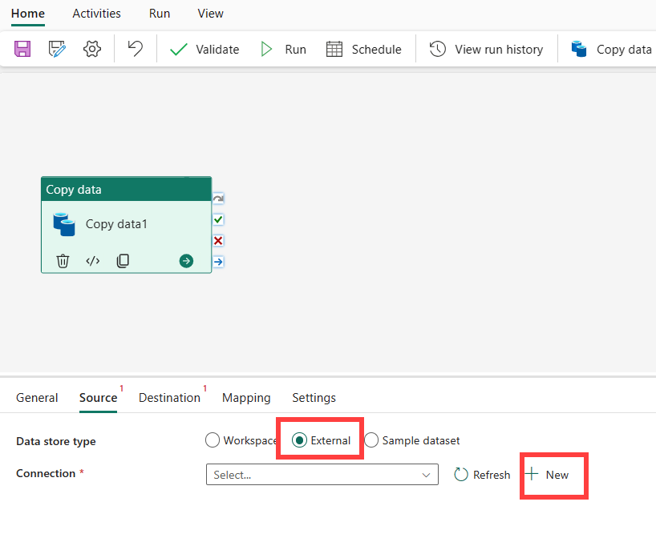
5. Choose **Azure SQL Database**, click Continue.
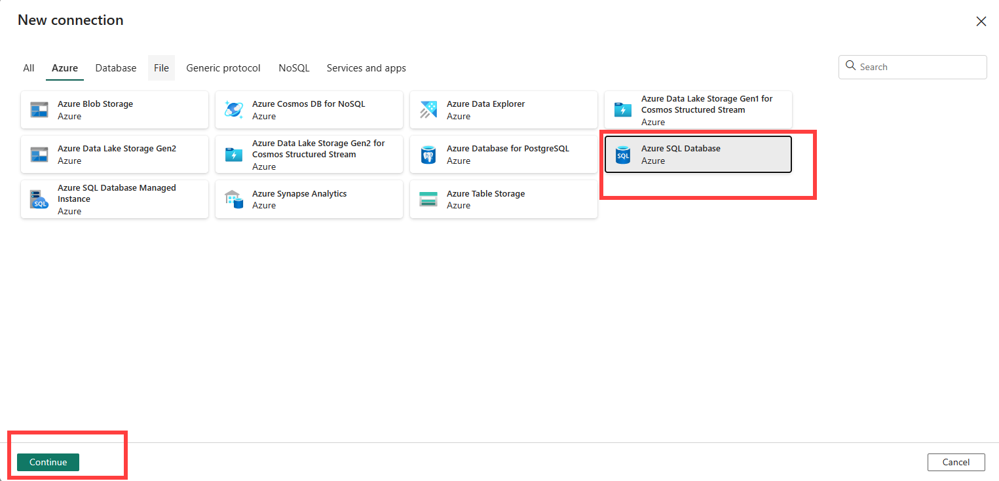
7. Enter the following Connection settings:  
   - Server: `adxdemo.database.windows.net`
   - Database: `aworks`
   - Username: `sqlread`
   - Password: `ChangeYourAdminPassword1`

8. Click Create
9. After creating and testing the External connection to the Azure SQL DB successfully, set the Database to `aworks` from the pick list.
10. Set Table to `SalesLT.Address` from the pick list. Note, it may take a few seconds to display the list of tables.

11. Click on **Destination** tab, select "Workspace", set Workspace ddata store type to **KQL Database**, set KQL Database to **RTADemo**, and select Table **Address** from the pick list.

12. (Optionally) You can click on the Mapping tab to Import schemas & verify all fields are mapped to the correct data types without warnings. However, this addiitonal step is not required for this excercise.
13. Click **Run** to execute the pipeline.

14. The **Output** tab should appear in a few seconds to monitor the progress.
15. The pipeline will run until you see Pipeline status ✅ **Succeeded**.

16. Click the **Run** button again to run it a second time. We are running the pipeline **twice** to show how we are deduplicating rows. 
17. After the pipeline ran twice successfully, let's check the data we copied.
18. (Optional) Open the "RTADemo" KQL Database in your Fabric Workspace and click "Explore your data" on the top right to write a query. Copy the following query and click **Run**:
```
Address
```
18. Open the KQL Queryset we saved previously in the workspace called "createAll" and click the + sign to open a new tab to write a query.
20. Double click the Table name `Address` to auto-type it to the query pane and click Run. Otherwise, copy the following query and click **Run**:
```
Address
```
20. Notice 900 records are returned at the top right of the result grid. However, in the Azure SQL DB (source) we have 450 rows. This is because the pipeline was ran twice. ie. 450 x 2 = 900. 
  
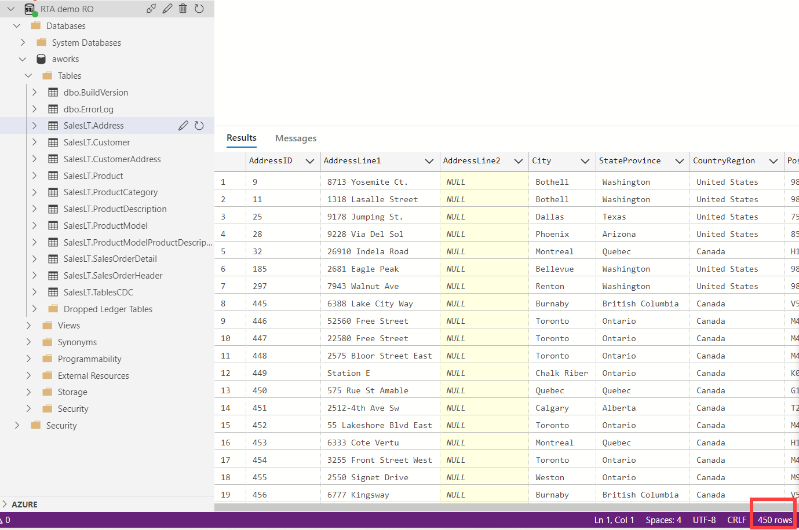
22. Next, query the `SilverAddress` table instead. **Run** the following query:
```
SilverAddress
```
23. Notice there are 900 rows and 1 additional column **IngestionDate** towards the right. This transformation occurred automatically in real-time by the KQL function `parseAddress()`. The function was defined in the [Update Policy](<https://learn.microsoft.com/fabric/real-time-intelligence/table-update-policy>) when we ran "createAll.kql" database script.

24. Next, run the following query:
```
GoldAddress
```
25. Notice there are 450 rows, since the Gold layer uses materialized views based on the maximum IngestionDate to show only the **latest** ingested rows. This transformation occured automatically in real-time by the [materialized-view](<https://learn.microsoft.com/azure/data-explorer/kusto/management/materialized-views/materialized-view-overview>). The view was defined in the "createAll.kql" database script. The `arg_max()` aggregate function is documented [here](<https://learn.microsoft.com/azure/data-explorer/kusto/query/arg-max-aggregation-function>). Materialized views always return an up-to-date result of the aggregation query (always fresh). Querying a materialized view is more performant than running the aggregation directly over the source table.
```
//GOLD LAYER
// use materialized views to view the latest changes in the orders table
.create materialized-view with (backfill=true) GoldAddress on table SilverAddress
{
    SilverAddress
    | summarize arg_max(IngestionDate, *) by AddressID
}
```
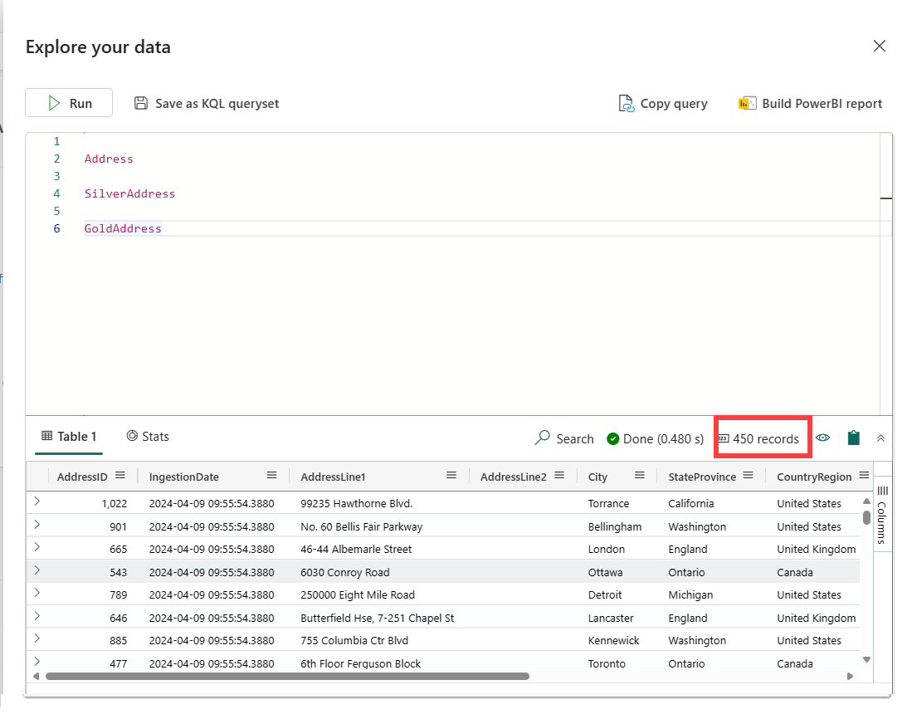

<div class="info" data-title="Note">
  
> Repeat the steps for the **Customer**, **SalesOrderHeader** and **SalesOrderDetail** tables.
</div>

## 11. Edit the Data Pipeline

1. Copy/Paste or duplicate the "Address" Copy Data activity onto the canvas three-times (3x). One for each additional table, then **change the Source & Destination** accordingly.
2. Notice how the Copy Activity Mapping for the **SalesOrderDetail** automatically maps sql data type `money` to `decimal` data type in KQL. You can see this by clicking Import schemas under the Mapping tab of the Copy Data activity. 
3. Right-click and deactivate the "Address" Copy Data activity, then **Run** the pipeline **twice** to execute the same scenario for the additional three Copy Data activities. Note, they will run in parrallel. 

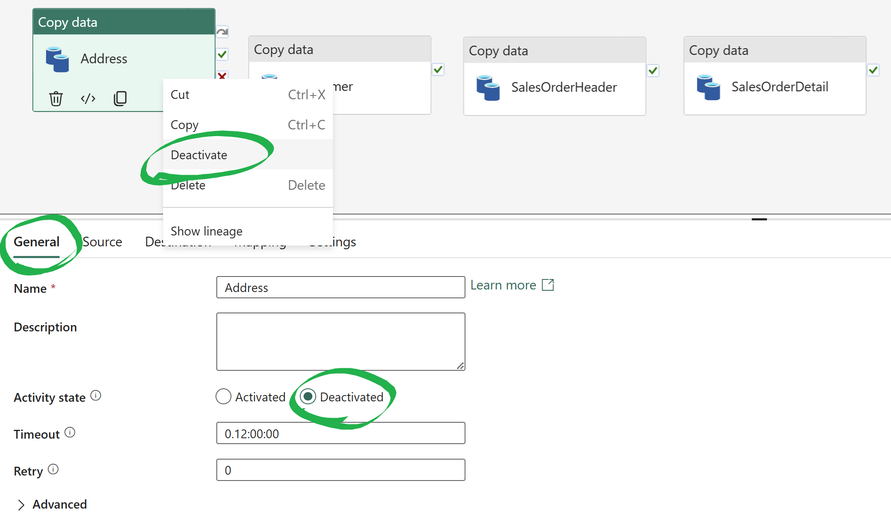
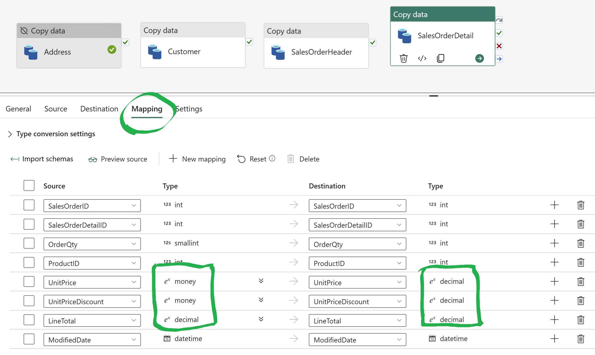


# 12. Real-Time Dashboard
In this section, we will build a real-time dashboard to visualize the streaming data and set it to refresh every 30 seconds. (Optionally) A pre-built version of the dashobard is available to download [here](<https://github.com/microsoft/FabricRTA-Retail/blob/main/dashboards/RTA%20dashboard/dashboard-RTA Dashboard.json>), which can be imported and configured to your KQL DB data source. 


1. Click + Create (button is located at top left Menu undreath Home).
2. Current workspace should be the same one.
3. Scroll down and choose **Real-Time Dashboard**
4. Name it "RTA Dashboard"
5. Click **+ Add tile**.
6. Click **+ Data source**. 
7. Set the **Database** to "RTADemo" & click Create. 
8. Proceed to paste each query below, add a visual, and apply changes. (Optionally) All queries are avilable in this script file [dashboard-RTA.kql](<https://github.com/microsoft/FabricRTA-Retail/blob/main/dashboards/RTA%20dashboard/dashboard-RTA.kql>).


### Clicks by hour
```
//Clicks by hour
events
| where eventDate between (_startTime.._endTime) and eventType == "CLICK" 
| summarize date_count = count() by bin(eventDate, 1h) 
| render timechart  
| top 30 by date_count
```

1. Set Time rage parameter at the top left to **Last 7 days**. This paramater is referenced by the query in the `where` clause by using fields `_startTime` and `_endTime`.
2. Click **Run**.
3. Click **+ Add visual**.
4. Format the visual.
5. Set Tile name to "Click by hour".
6. Set Visual type to **Area chart**.
7. Click **Apply Changes**.


9. While editing the dashboard, click **Manage** on the top left, and click **Parameters**.
10. Edit the "Time range" parameter by setting the Default value to **Last 7 Days**, click Close & Done.

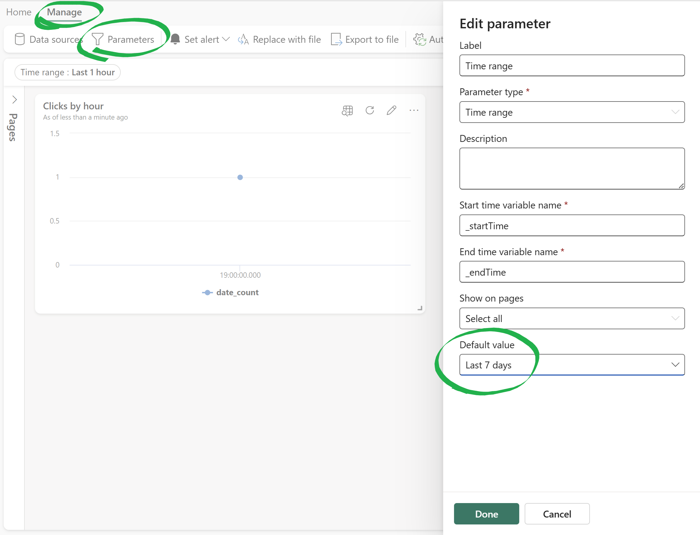

11. Click **+ Add tile** again to proceed with the next visuals.

### Impressions by hour
12. Visual type: **Area chart**
```
//Impressions by hour
events 
| where eventDate between (_startTime.._endTime) and eventType == "IMPRESSION" 
| summarize date_count = count() by bin(eventDate, 1h) 
| render timechart  
| top 30 by date_count 
```


### Impressions by location
12. Visual type: **Map**
```
//Impressions by location
events 
| where eventDate  between (_startTime.._endTime) and eventType == "IMPRESSION" 
| join external_table('products') on $left.productId == $right.ProductID 
| project lon = toreal(geo_info_from_ip_address(ip_address).longitude), lat = toreal(geo_info_from_ip_address(ip_address).latitude), Name 
| render scatterchart with (kind = map) //, xcolumn=lon, ycolumns=lat)
```
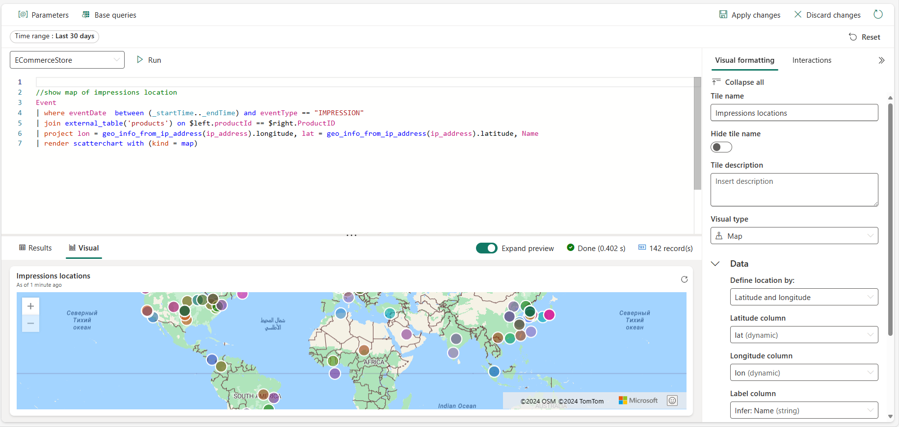

### Average Page Load time
13. Visual type: **Timechart**
```
//Average Page Load time
events 
| where eventDate   between (_startTime.._endTime) and eventType == "IMPRESSION" 
| summarize average_loadtime = avg(page_loading_seconds) by bin(eventDate, 1h) 
| render linechart 
```


### Impressions, Clicks & CTR
14. Add a tile & paste the query below once. Note, this is a multi-statement query that uses multiple let statements & a query combined by semicolons. 
15. Set Tile name: **Impressions**
16. Visual type: **Stat**
17. Data Value column to `impressions`.
18. Click **Apply changes**.
19. Click the 3-dots (...) at the top right of the tile you just created to **Duplicate** it two more times.
20. Name the 2nd one **Clicks**, set the Data value column to `clicks`, then Apply changes.
21. Name the 3rd **Click Through Rate**, set the Data value column to `CTR`, then Apply changes.
```
//Clicks, Impressions, CTR
let imp =  events 
| where eventDate  between (_startTime.._endTime) and eventType == "IMPRESSION" 
| extend dateOnly = substring(todatetime(eventDate).tostring(), 0, 10) 
| summarize imp_count = count() by dateOnly; 
let clck = events 
| where eventDate  between (_startTime.._endTime) and eventType == "CLICK" 
| extend dateOnly = substring(todatetime(eventDate).tostring(), 0, 10) 
| summarize clck_count = count() by dateOnly;
imp  
| join clck on $left.dateOnly == $right.dateOnly 
| project selected_date = dateOnly , impressions = imp_count , clicks = clck_count, CTR = clck_count * 100 / imp_count
```
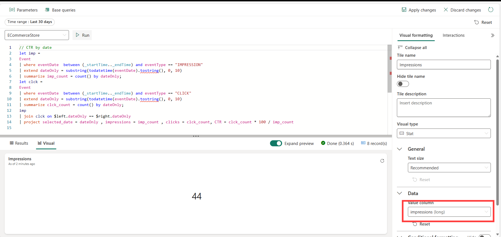


### Auto-refresh
22. While editing the dashboard, click **Manage** > **Auto refresh**.
23. Set it to **Enabled**, and **Default** refresh rate to **30 seconds**, click Apply.
24. Click **Home** and then **Save**.

## 13. Reflex
1. While editing the dashboard, click **Manage** > Set Alert.
2. Choose "Clicks by hour"
3. Select Condition "Becomes greater than"
4. Set Value to 250.
5. Action choose **Message me in Teams**.
6. Click Create.

<div class="info" data-title="Note">
  
> The Reflex item will appear in your workspace and you can edit the Reflex trigger action. The same Reflex item can also trigger multiple actions. 
</div>


## 13. Stop the notebook
At this point you've completed the lab, so you may stop running the notebook. 
1. Open the notebook "Generate synthetic events" from your workspace and click **Stop** on the last code cell if its still running.
2. (Optionally) You can click **Cancel All** on the top menu or click the stop red-sequare button to Stop session. These only appear when your session is active or the notebook is running.


## THAT's ALL FOLKS!!

🎉 Congratulations on completing this lab! 

Did you like it, did you not like it? Let us know in this short [Eval](<https://forms.office.com/r/xhW3GAtAhi>). Scan this QR Code to open the Eval form on your phone.

  

If you'd like to contribute to this lab or report a bug-issue, please send a Pull-request for us to review or submit the issue in our [GH repo](<https://github.com/microsoft/FabricRTA-Retail/>).

---

## Continue your learning

- [Implement a Real-Time Intelligence Solution with Microsoft Fabric](<https://learn.microsoft.com/training/paths/explore-real-time-analytics-microsoft-fabric/>)
- [Real-Time Intelligence documentation in Microsoft Fabric](<https://aka.ms/fabric-docs-rta>)
- [Microsoft Fabric Updates Blog](<https://aka.ms/fabricblog>)
- [Get started with Microsoft Fabric](<https://aka.ms/fabric-learn>)


### Thank you!


